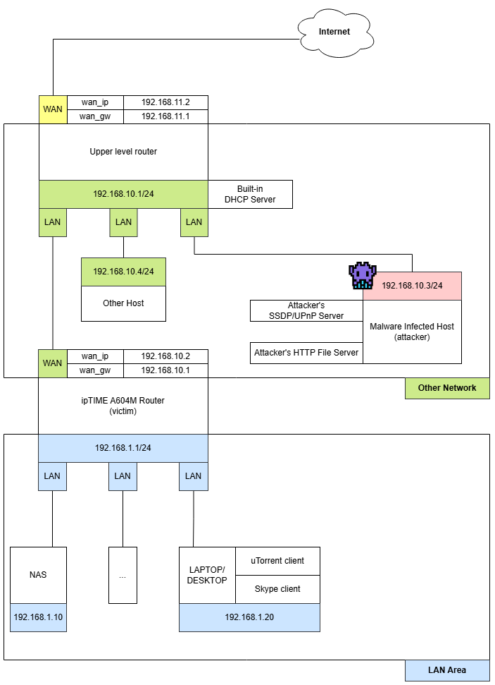
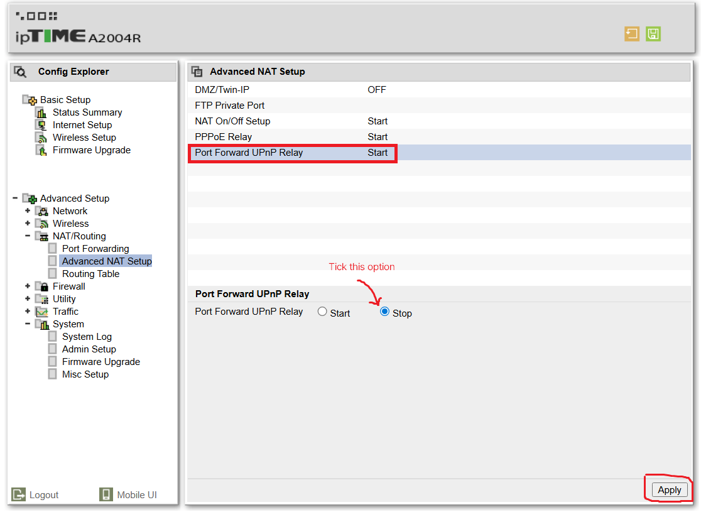

# CVE-2025-55423
This vulnerability is command injection that allows root access to 163 routers from ipTIME a router manufacturer without prior authentication.

- [Description](#description)
- [Affected Device](#affected-device)
- [Bug Type](#bug-type)
- [Network Diagram](#network-diagram)
- [Attack Scenario](#attack-scenario)
    * [Phase1 - Network RECON and ARP spoofing](#phase1---network-recon-and-arp-spoofing)
    * [Phase2 - Blocking T1 DHCP requests](#phase2---blocking-t1-dhcp-requests)
    * [Phase3 - ARP spoofing without IP forwarding: causing users to reboot](#phase3---arp-spoofing-without-ip-forwarding-causing-users-to-reboot)
- [PoC](#poc)
    * [Directory Tree](#directory-tree)
    * [Example Usage](#example-usage)
    * [Demo Video](#demo-video)
    * [Details](#details)
- [Mitigation Recommandations of EOS Routers](#mitigation-recommandations-of-eos-routers)
- [Patch and Fix](#patch-and-fix)
- [Conclusion](#conclusion)
- [Credits](#credits)


## Description

A command injection vulnerability exists when the controlURL used by a device to pass port forwarding information to its upper router is used as an argument to system() without validation.
```
[Source(KR)]
https://iptime.com/iptime/?pageid=5&page_id=126&dfsid=3&dftid=272&uid=17135&mod=document

📑 About the "UPnP Relay" feature
- This feature was added as a in firmware versions 9.90.4 or 9.90.6 or 9.90.8.
- The ability to set the port defined by the method below as the port forward rule for the parent router via UPNP when UPNPD is detected on a WAN port.
  - Ports added or deleted SOAP Action in UPnPD(LAN side).
  - User added ports.
  - A server(NAS) or device(CCTV) that supports UPnP feature.
- Default value of UPNP Relay feauture is 'ON'
```

## Affected Device

Affects 163 routers from ipTIME. For more information, see this [link](https://docs.google.com/spreadsheets/d/1kryOFltCmnPJvDTpIrudgryt79uI4PWchuQ8-Gak24c/edit?gid=0#gid=0)

## Bug Type

Command Injection

## Network Diagram
<p align="center">
        
</p>


## Attack Scenario

> This attack scenario is based on the premise that 192.168.10.3 is infected with malware.

### Phase1 - Network RECON and ARP spoofing

1. The attacker obtains network information about the WAN area (192.168.10.0/24) through recon.
2. The attacker runs an SSDP/UPnP server containing a command injection payload.
3. The attacker performs ARP spoofing on the equipment acting as DHCP (DHCP server, firewall with built-in DHCP server, router with built-in DHCP server) and the target router(A604M).
    - At this point, the attacker must enable IP forwarding.

### Phase2 - Blocking T1 DHCP requests and manipulate DHCP ACK

1. The attacker filters DHCP Request(unicast) generated when T1 (lease expiration 50%) occurs on the target router.
    - At this point, due to IP forwarding, the DHCP request is forwarded to the built-in DHCP server of the target router. This means that the IP address may be renewed, which is not the desired state for the attacker.
    - To resolve this issue, use WinDivert to block DHCP request packets that are forwarded through IP forwarding.
2. When a DHCP Request is detected by filtering, the DHCP ACK response is manipulated to include information desired by the attacker.
    - Set the IP address to an IP address that has not been assigned (e.g. 192.168.10.77/24).
    - Set the gateway address to the attacker's IP (e.g. 192.168.10.3/24).
3. When a new IP is assigned to the target router, the target router sends M-SEARCH packets to the WAN area and connects to the attacker's SSDP/UPnP server.
    - SSDP M-SEARCH Request(Multicast) on the same networks(192.168.10.0/24)
    - Response: LOCATION: http://192.168.10.3:7777/gaetdesc.xml
    - Found attacker’s UPnP Server

### Phase3 - ARP spoofing without IP forwarding: causing users to reboot

1. The vulnerability is triggered when a port forwarding rule is added or deleted by an UPnP client, a device that supports UPnP, or a server that supports UPnP (such as NAS).
2. Perform ARP spoofing with the newly assigned IP (192.168.10.77), but this time without ip forwarding.
3. In that case, the hosts connected to the target router will not be forwarded and will lose their connection to the Internet.
4. Users who lose their Internet connection usually think that rebooting is an alternative solution to the problem, which causes the UPnP Client to restart.
5. Finally, the UPnP client(uTorrent) restarts, triggering an AddPortMapping event and adding the port to the target router.
    - The target router parses the XML of the UPnP server (In this case, the attacker's UPNP server) to obtain the controlURL in order to forward ports to the upper level router, and this is where command injection is used.

## PoC
### Directory Tree
```
/poc
 |--- /pre_script
 |     |--- spoofer.py(https://github.com/davidlares/arp-spoofing)
 |     |--- dhcp_ack.py(filter of dhcp_request -> manifulate dhcp ack send to victim)
 |     |--- dhcp_req_block.py
 |--- /ssdp_upnp_server - base code on https://github.com/ZeWaren/python-upnp-ssdp-example
 |      |--- __main__.py (Set payload and trigger)
 |      |--- /lib
 |            |--- ssdp.py (Attacker SSDP Server)
 |            |--- upnp_http_server.py (Attacker UPnP Server)
```
### Example Usage
```
# OS : Windows 11
# python version : Python 3.13.5
# attakcer ip   = 192.168.10.3
# victim router = 192.168.10.2
# dhcp server   = 192.168.10.1

PS C:\CVE-2025-55423\poc\ssdp_upnp_server>python __main__.py 192.168.10.3
PS C:\CVE-2025-55423\poc\pre_script>python spoofer.py -t 192.168.10.2 -s 192.168.10.1 -i Wi-Fi
PS C:\CVE-2025-55423\poc\pre_script>python dhcp_ack.py -v 192.168.10.2 -d 192.168.10.1 -a 192.168.10.3 -i Wi-Fi
PS C:\CVE-2025-55423\poc\pre_script>python dhcp_req_block.py
```

### Demo Video


### Details
```
The vulnerable library names and functions where code injection occurs are listed below:

    Old version: /lib/libcgi.so
         - upnp_relay()

    New version: /lib/libesysapi.so
        - upnp_relay_add()
        - upnp_relay_rm()
```
In this document analyzes the vulnerability based on the `ipTIME A604M router` and the `a604m_kr_10_064.bin` firmware.

<p align="center">
	
</p>

We can see that the upnp_relay() vulnerability could lead to a command injection vulnerability if v17 is controllable because there is no validation in the part that calls the system2 function. So how does v17 take control?
```
v17 can be controlled by the two functions below:
    - istatus_get_value_direct(“igd_url”, v17)
    - istatus_set_value_direct(“igd_url”, “your_igd_url”)
It simply uses file I/O to read and write values stored in a file.
```
In other words, we need to focus on discover_upper_upnp_igd() at line 75(Figure 1).

<p align="center">
        
</p>

Breaking down the above code into a series of steps, we can outline it as follows:
1. Use popen() to create the /sbin/upnpc binary as a child process.
2. Compare the output of the child process line by line using fgets() and check for the string "Found valid IGD".
3. If "Found valid IGD" exists, move the string pointer to `http` with strstr().
4. Call istatus_set_value_direct() to store the string that is assumed to be a link in igd_url.

So, if we analyze the feature of upnpc and the conditions under which it outputs "Found valid IGD", wouldn't we be able to control the igd_url if we analyzed the program?

```
# upnpc
    - This binary is based on the miniupnp: UPnP IGD implementation  project,
    with features added by the vendor.
    - This binary is supporting feature of the UPnP client.
and you can find descriptions of the main argument used by upnpc below:

# main argument
provide ip address (ipv4) or interface name (ipv4 or v6) to use for sending SSDP multicast packets:
    upnpc -m address/interface
Get Presentation url:
    upnpc [options] -P
Delete port redirection:
    upnpc [options] -d external_port protocol <remote host>
Add port redirection:
    upnpc [options] -a ip port external_port protocol [duration]
bypass discovery process by providing the XML root description url:
    upnpc -u url
```
Going back to the code again(Figure 2), you can see that at line 18 we call `/sbin/upnpc -m %s -P.`  `%s` obtains the IP address from the WAN1 network interface, so execute the command in the form `upnpc -m <address> -P.`
The upnpc binary can be easily analyzed by knowing the function of the three functions below:
```
    1. upnpc -m <address> -P: upnpDiscover() → UPNP_GetValidIGD()
    2. upnpc -u IGD_URL: → UPNP_GetIGDFromUrl()
```
And you find the oasis you've been looking for in upnpc code: "Found valid IGD".

<p align="center">
        
</p>

UPNP_GetValidIGD() return value must be 1 to output "Found valid IGD". Before analyzing UPNP_GetValidIGD(), analysis of the v13, v100, v106, and v89 argument is required.

<p align="center">
        
</p>

```
UPNP_GetValidIGD() argument analysis results
   - a1(v13, input): v13 is the result value of the upnpDiscover() call.
   - a2(v100, output): Parsing result for service type WANIPConnection:1 in xml
      - v100[0] : <controlURL>/etc/linuxigd/gateconnSCPD.ctl</controlURL>
      - v100[1] : <SCPDURL>/etc/linuxigd/gateconnSCPD.xml</SCPDURL>
   - a3(v106, output): eventSubURL
   - a4(v89, output): requestWanIP(192.168.10.2)
```
upnpDiscover() is a function that is largely irrelevant to the vulnerability, so we can simply summarize it as:
- SSDP M-SEARCH Packet to 239.255.255.250(Multicast)
- Respond with the SSDP server information (ST, LOCATION) in the WAN zone.
    * v13[1]: (LOCATION, http://192.168.10.3:7777/gatedesc.xml)
    * v13[2]: (ST, urn:schemas-upnp-org:device:InternetGatewayDevice:1)
    
Now that we understand the purpose of the arguments of UPNP_GetValidIGD(), it is time to analyze UPNP_GetValidIGD().

<p align="center">
        
</p>

The first goal is that the return value of miniwget_getaddr() at line 38 (Figure 5) must be set 1. Once the first objective is achieved, you can parse the xml (parserootdesc) and set the attack payload in a2. To do that, we need to analyze miniwget_getaddr() first.

<p align="center">
        
</p>

We need to call miniwget2() at line 30(Figure 6) to make the return value 1. To do this, we need to compare the v16 and the getdefaultgateway() result with strcmp() should match.

<p align="center">
        
</p>

getdefaultgateway() retrieves gateway information for the subnet to which the WAN IP belongs from /proc/net/route. In this attack scenario, the gateway is changed to the attacker's IP address when T1 is updated.

<p align="center">
        
</p>

<p align="center">
        
</p>

And finally, we call miniwget3() to send an HTTP GET request to LOCATION. If a GET request is sent and the URI in Figure 6 is responded, the return value is set to 1, and the first goal in Figure 5 is achieved.

<p align="center">
        
</p>

The parserootdesc() at line 43(Figure 10) parses gatedesc.xml and stores the results in a3. It checks whether WANCommonInterfaceConfig:1 exists in the provided xml and calls GetUPNPUrls() at line 48.

<p align="center">
        
</p>

GetUNPUrls() stores four elements in a2 based on WANCommonInterfaceConfig, as shown in Figure 12 below.

<p align="center">
        
</p>

Return to Figure 10. If UPNPIGD_IsConnected() at line 49 is satisfied, v8 will be set to 1 and Found valid IGD will be called.

<p align="center">
        
</p>

However, UPNPIGD_IsConnected() will always return 1. Then, as shown in Figure 12, modify the controlURL of WANIPConnection:1 to the command injection payload.

<p align="center">
        
</p>

<p align="center">
        
</p>

The igd_url will store the Found Valid IGD string, which will allow the attacker to execute the desired command in line 106 (when the port forwarding rule is deleted) and line 114 (when the port forwarding rule is added) in Figure 1.

## Mitigation Recommandations of EOS Routers

We have confirmed that patches have been completed for non-EoS product families (23 products) for CVE-2025-55423: OS Command Injection vulnerability through the 26/01/15 patch notes. However, the vendor recommended that the devices be discarded or the functionality disabled (port forwarding relay function) as firmware support is no longer available for the EoS product line (97 models) as the service has ended (EoS).

<p align="center">
        
</p>

## Patch and Fix

The vendor(ipTIME) patched the vulnerability by using execvpe and execvp instead of system() to prevent shell metacharacters from being interpreted, and we confirmed the patch in `libcgi.so` of the patched firmware, `a1004_ml_12_180.bin`. ipTIME provides patched firmware at this [link](https://iptime.com/iptime/?page_id=126&uid=27033&mod=document).

## Conclusion
As demonstrated in the demo video and attack scenario, the CVE-2025-55423 vulnerability allows an attacker on the same network to gain root privileges on the router without prior authentication. While the conditions for this vulnerability are complex, many routers are affected, so if you use one of these routers, please refer to the mitigation information or apply a patch.

## Credits
[CoreSecurity OT/ICS Research Team](https://www.coresec.co.kr/ot-iot-%EC%B7%A8%EC%95%BD%EC%A0%90-red-team-%EC%84%9C%EB%B9%84%EC%8A%A4-item)
